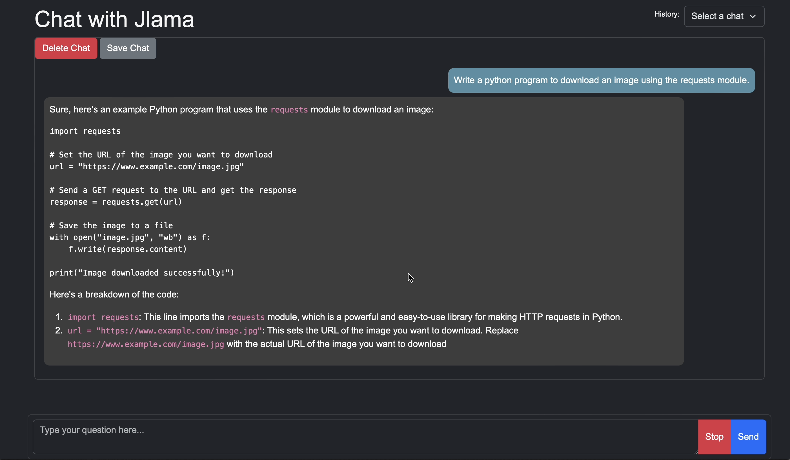

# 🦙 Jlama: A modern LLM inference engine for Java

<p align="center">
  
</p>

[](https://central.sonatype.com/artifact/com.github.tjake/jlama-core/overview)
[](LICENSE)
[](https://discord.gg/HsYXHrMu6J)
[](https://deepwiki.com/tjake/Jlama)


## 🚀 Features

Model Support:
  * Gemma & Gemma 2 Models
  * Llama & Llama2 & Llama3 Models
  * Mistral & Mixtral Models
  * Qwen2 Models
  * IBM Granite Models
  * GPT-2 Models
  * BERT Models
  * BPE Tokenizers
  * WordPiece Tokenizers

Implements:
  * Paged Attention
  * Mixture of Experts
  * Tool Calling
  * Generate Embeddings
  * Classifier Support
  * Huggingface [SafeTensors](https://github.com/huggingface/safetensors) model and tokenizer format
  * Support for F32, F16, BF16 types
  * Support for Q8, Q4 model quantization
  * Fast GEMM operations
  * Distributed Inference!

Jlama requires Java 20 or later and utilizes the new [Vector API](https://openjdk.org/jeps/448) 
for faster inference.

## 🤔 What is it used for? 

Add LLM Inference directly to your Java application. To learn more read the [DeepWiki](https://deepwiki.com/tjake/Jlama) docs.

## 🔬 Quick Start

### 🕵️‍♀️ How to use as a local client (with jbang!)
Jlama includes a command line tool that makes it easy to use.

The CLI can be run with [jbang](https://www.jbang.dev/download/).

```shell
#Install jbang (or https://www.jbang.dev/download/)
curl -Ls https://sh.jbang.dev | bash -s - app setup

#Install Jlama CLI (will ask if you trust the source)
jbang app install --force jlama@tjake
```

Now that you have jlama installed you can download a model from huggingface and chat with it.
Note I have pre-quantized models available at https://hf.co/tjake

```shell
# Run the openai chat api and UI on a model
jlama restapi tjake/Llama-3.2-1B-Instruct-JQ4 --auto-download
```

open browser to http://localhost:8080/

<p align="center">
  
</p>


```shell
Usage:

jlama [COMMAND]

Description:

Jlama is a modern LLM inference engine for Java!
Quantized models are maintained at https://hf.co/tjake

Choose from the available commands:

Inference:
  chat                 Interact with the specified model
  restapi              Starts a openai compatible rest api for interacting with this model
  complete             Completes a prompt using the specified model

Distributed Inference:
  cluster-coordinator  Starts a distributed rest api for a model using cluster workers
  cluster-worker       Connects to a cluster coordinator to perform distributed inference

Other:
  download             Downloads a HuggingFace model - use owner/name format
  list                 Lists local models
  quantize             Quantize the specified model
  rm                   Removes local model
  version              Display JLama version information
```


### 👨‍💻 How to use in your Java project
The main purpose of Jlama is to provide a simple way to use large language models in Java.

The simplest way to embed Jlama in your app is with the [Langchain4j Integration](https://github.com/langchain4j/langchain4j-examples/tree/main/jlama-examples).  

If you would like to embed Jlama without langchain4j, add the following [maven](https://central.sonatype.com/artifact/com.github.tjake/jlama-core/) dependencies to your project:

```xml

<dependency>
  <groupId>com.github.tjake</groupId>
  <artifactId>jlama-core</artifactId>
  <version>${jlama.version}</version>
</dependency>

<dependency>
  <groupId>com.github.tjake</groupId>
  <artifactId>jlama-native</artifactId>
  <!-- supports linux-x86_64, macos-x86_64/aarch_64, windows-x86_64 
       Use https://github.com/trustin/os-maven-plugin to detect os and arch -->
  <classifier>${os.detected.name}-${os.detected.arch}</classifier>
  <version>${jlama.version}</version>
</dependency>

```

jlama uses Java 21 preview features. You can enable the features globally with:

```shell
export JDK_JAVA_OPTIONS="--add-modules jdk.incubator.vector --enable-preview"
```
or enable the preview features by configuring maven compiler and failsafe plugins.


Then you can use the Model classes to run models:

```java
 public void sample() throws IOException {
    String model = "tjake/Llama-3.2-1B-Instruct-JQ4";
    String workingDirectory = "./models";

    String prompt = "What is the best season to plant avocados?";

    // Downloads the model or just returns the local path if it's already downloaded
    File localModelPath = new Downloader(workingDirectory, model).huggingFaceModel();
    
    // Loads the quantized model and specified use of quantized memory
    AbstractModel m = ModelSupport.loadModel(localModelPath, DType.F32, DType.I8);

    PromptContext ctx;
    // Checks if the model supports chat prompting and adds prompt in the expected format for this model
    if (m.promptSupport().isPresent()) {
        ctx = m.promptSupport()
                .get()
                .builder()
                .addSystemMessage("You are a helpful chatbot who writes short responses.")
                .addUserMessage(prompt)
                .build();
    } else {
        ctx = PromptContext.of(prompt);
    }

    System.out.println("Prompt: " + ctx.getPrompt() + "\n");
    // Generates a response to the prompt and prints it
    // The api allows for streaming or non-streaming responses
    // The response is generated with a temperature of 0.7 and a max token length of 256
    Generator.Response r = m.generate(UUID.randomUUID(), ctx, 0.0f, 256, (s, f) -> {});
    System.out.println(r.responseText);
 }
```

Or you can use a **Builder API**:

```java
 public void sample() throws IOException {
    String model = "tjake/Llama-3.2-1B-Instruct-JQ4";
    String workingDirectory = "./models";

    String prompt = "What is the best season to plant avocados?";

    // Downloads the model or just returns the local path if it's already downloaded
    File localModelPath = new Downloader(workingDirectory, model).huggingFaceModel();
    
    // Loads the quantized model and specified use of quantized memory
    AbstractModel m = ModelSupport.loadModel(localModelPath, DType.F32, DType.I8);

    PromptContext ctx;
    // Checks if the model supports chat prompting and adds prompt in the expected format for this model
    if (m.promptSupport().isPresent()) {
        ctx = m.promptSupport()
                .get()
                .builder()
                .addSystemMessage("You are a helpful chatbot who writes short responses.")
                .addUserMessage(prompt)
                .build();
    } else {
        ctx = PromptContext.of(prompt);
    }

    System.out.println("Prompt: " + ctx.getPrompt() + "\n");
    // Generates a response to the prompt and prints it
    // The api allows for streaming or non-streaming responses
    // The response is generated with a temperature of 0.7 and a max token length of 256
    Generator.Response r = m.generateBuilder()
            .session(UUID.randomUUID()) //By default, UUID.randomUUID()
            .promptContext(ctx) // Required or use prompt(String text)
            .ntokens(256) //By default, 256
            .temperature(0.0f) //By default, 0.0f
            .onTokenWithTimings((s, aFloat) -> {}) //By default, (s, aFloat) -> {}, nothing
            .generate();
    
    System.out.println(r.responseText);
 }
```

You can simplify promptSupport using:

```java
 public void sample() throws IOException {
    String model = "tjake/Llama-3.2-1B-Instruct-JQ4";
    String workingDirectory = "./models";

    String prompt = "What is the best season to plant avocados?";

    // Downloads the model or just returns the local path if it's already downloaded
    File localModelPath = new Downloader(workingDirectory, model).huggingFaceModel();
    
    // Loads the quantized model and specified use of quantized memory
    AbstractModel m = ModelSupport.loadModel(localModelPath, DType.F32, DType.I8);
    
    var systemPrompt = "You are a helpful chatbot who writes short responses.";

    PromptContext ctx = m.prompt()
                        .addUserMessage(prompt)
                        .addSystemMessage(systemPrompt)
                        .build(); //build method will create a PromptContext, if model don't support prompt, a simple PromptContext object will be created

    System.out.println("Prompt: " + ctx.getPrompt() + "\n");
    // Generates a response to the prompt and prints it
    // The api allows for streaming or non-streaming responses
    // The response is generated with a temperature of 0.7 and a max token length of 256
    Generator.Response r = m.generateBuilder()
            .session(UUID.randomUUID()) //By default, UUID.randomUUID()
            .promptContext(ctx) // Required or use prompt(String text)
            .ntokens(256) //By default, 256
            .temperature(0.0f) //By default, 0.0f
            .onTokenWithTimings((s, aFloat) -> {}) //By default, (s, aFloat) -> {}, nothing
            .generate();
    
    System.out.println(r.responseText);
 }
```

## ⭐ Give us a Star! 

If you like or are using this project to build your own, please give us a star. It's a free way to show your support.

## 🗺️ Roadmap

* Support more and more models
* <s>Add pure java tokenizers</s>
* <s>Support Quantization (e.g. k-quantization)</s>
* Add LoRA support
* GraalVM support
* <s>Add distributed inference</s>

## 🏷️ License and Citation

The code is available under [Apache License](./LICENSE).

If you find this project helpful in your research, please cite this work at

```
@misc{jlama2024,
    title = {Jlama: A modern Java inference engine for large language models},
    url = {https://github.com/tjake/jlama},
    author = {T Jake Luciani},
    month = {January},
    year = {2024}
}
```
